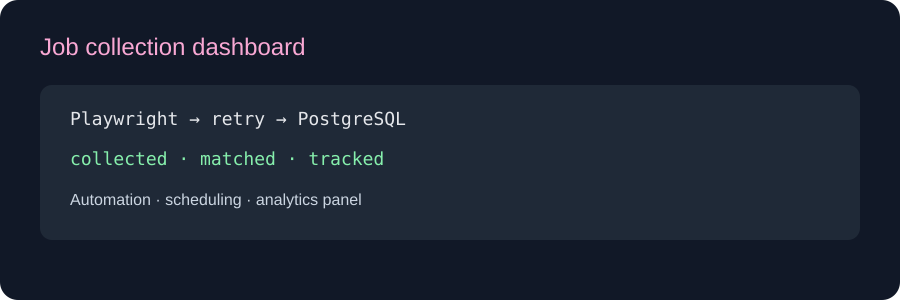

# Etsy Data Pipeline

[English](README.md) | [Türkçe](README_TR.md) | [Deutsch](README_DE.md)



## Portfolio demo

The collector flow is Playwright-ready: collect listings, retry transient failures, persist records and inspect matching/status analytics in the dashboard.

A production-style browser automation and data engineering project built from the original Etsy collection concept. It runs scheduled Playwright collection jobs, retries transient failures, upserts normalized listing data into PostgreSQL, keeps price observations, and presents a compact analytics dashboard.

## Features

- Async Playwright collector with resilient locators
- Exponential retry with a three-attempt limit
- APScheduler interval jobs with concurrency protection
- PostgreSQL listings, pipeline runs, and price observations
- Idempotent listing upserts by canonical source URL
- Allowed-host validation and configurable collection limits
- Offline demo mode with deterministic sample data
- REST API and responsive analytics dashboard
- Docker Compose, tests, Ruff, and GitHub Actions CI

## Responsible use

Use Playwright mode only on pages you own or are authorized to automate. Review the target site's current terms, robots policy, API availability, rate limits, copyright rules, and privacy requirements. Prefer an official API when one is available. The project intentionally does not bypass authentication, CAPTCHAs, access controls, or anti-bot protections.

## Architecture

```text
APScheduler / manual API trigger
              │
              ▼
   Demo or Playwright collector ──> retry + normalization
                                           │
                                           ▼
                            PostgreSQL upsert + observations
                                           │
                            ┌──────────────┴──────────────┐
                            ▼                             ▼
                         REST API                 Analytics dashboard
```

## Docker quick start

```bash
cp .env.example .env
docker compose up --build
```

Open:

- Dashboard: `http://localhost:8002`
- Swagger: `http://localhost:8002/docs`
- Health: `http://localhost:8002/health`

The default `COLLECTOR_MODE=demo` works offline. Click **Run pipeline now** to insert sample records and populate the dashboard.

## Authorized Playwright mode

Update `.env` only after confirming you are allowed to collect the target:

```env
COLLECTOR_MODE=playwright
TARGET_URL=https://www.etsy.com/your-authorized-page
ALLOWED_HOSTS=["www.etsy.com","etsy.com"]
SCHEDULE_HOURS=6
```

The DOM extraction contract is isolated in `PlaywrightCollector`, making selector updates easy when the permitted target changes.

## API

| Method | Endpoint | Purpose |
|---|---|---|
| `GET` | `/health` | Service and collector mode |
| `POST` | `/api/v1/pipeline/run` | Trigger one collection run |
| `GET` | `/api/v1/runs` | Recent run history |
| `GET` | `/api/v1/listings` | Latest normalized listings |
| `GET` | `/api/v1/summary` | Dashboard aggregates |

## Local development

```bash
python -m venv .venv
pip install -e ".[dev]"
python -m playwright install chromium
cp .env.example .env
uvicorn app.main:app --reload --port 8002
```

When the API runs outside Docker, set the database host to `localhost` and port to `5434`.

## Quality checks

```bash
ruff check .
ruff format --check .
pytest -q
```

## Production roadmap

- Alembic migrations and retention policies
- PostgreSQL advisory locks for multi-replica scheduling
- Structured logs, Prometheus metrics, and alerting
- Proxy/rate-limit policy for authorized high-volume sources
- Authentication, tenant separation, and export endpoints
- Cloud deployment with managed PostgreSQL and secret management
